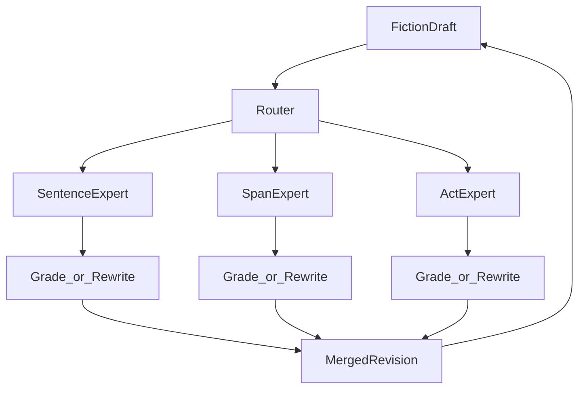
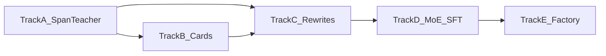

# MoE Style Editor — Training System & Roadmap

**Status:** Architecture + gap analysis (Jul 2026)  
**Audience:** Training / Romance Factory integration  
**Related:** [`PHASE5_STYLE_STEERING.md`](PHASE5_STYLE_STEERING.md), [`source/multi-pass.md`](../source/multi-pass.md), [`GPU_RUNBOOK.md`](GPU_RUNBOOK.md)

---

## North-star

Build a **Mixture-of-Experts (MoE) style editor LLM** that can **review and revise the style** of a wide selection of fiction — not invent plot, not rank “literary quality,” but **grade and edit style at multiple granularities**.

Three editing experts share one MoE backbone (or three LoRA adapters on the same MoE base):

| Expert | Unit of work | Typical length | Primary job |
|--------|--------------|----------------|-------------|
| **Sentence editor** | One sentence (or clause cluster) | ~5–40 words | Fine-grain style: diction, rhythm, local figurative load, micro-register |
| **Span editor** | Contiguous prose span | ~200–350 words | Local voice / tone / FID / distance — Romance Factory act-beat grading |
| **Act editor** | Scene / act / short chapter | ~500–1500+ words | Broader consistency vs a steering card; drift across beats |

A **router** (prompted role, or learned gate) selects which expert(s) run for a given request. The shared backbone is trained so experts specialize without forgetting the Leech & Short rubric.



This document describes **how the training system is implemented today**, **what the training data is for**, **where we are**, **gaps**, and **what must be completed** to reach that MoE editor.

---

## Intended purpose of the training data

Training data exists to teach models three complementary skills:

1. **Judge** — Given prose at a given grain, emit a structured `style_profile` (and optional evidence / rationale).
2. **Critique** — Explain *why* a label fits (or why a span mismatches a target card), grounded in quoted evidence.
3. **Edit** — Rewrite prose so it better matches a target steering card / label set, without changing plot facts.

Phases 1–4 of this repo built a **judge**. Phases 5–6 (and the MoE editor goal) turn that judge into **critique + edit** at sentence / span / act scale for Romance Factory’s draft → grade → revise loop.

| Data product | Teaches | Consumes |
|--------------|---------|----------|
| Classification pairs | Full JSON `style_profile` | Styled JSONL `metadata.style_profile` |
| Judgment pairs | Single-dimension label + short NL explanation | Same profiles |
| Critique pairs *(emerging)* | Evidence-backed rationale | Council `style_council` votes + arbitrator |
| Match / mismatch pairs *(planned 5B)* | “Does this text match card C?” | Profile vs `steering_card` |
| Rewrite pairs *(planned 5D / Phase 3B)* | “Rewrite to match card C” | Before/after prose + cards |

**Design rule:** Prefer **council-labeled** (or Gemma-bakeoff-trusted) profiles over early joint multi-field labels for any new editor training mix. Version every label set (`style_profile_version`).

---

## How the training system is implemented today

### Pipeline overview (Phases 1–4)

```
PDF / Style-in-Fiction
  → Phase 1: rubric + knowledge RAG
  → Phase 2: chunk corpus → style_profile on JSONL
  → Phase 3: instruction pairs (classify + judgment)
  → Phase 4: Gemma 4 MoE LoRA SFT on DGX Spark
  → GGUF export → LM Studio / bake-off (5A)
```

| Phase | What it does | Key code / artifacts |
|-------|--------------|----------------------|
| **1** | Extract Leech & Short rubric + knowledge | `source/style_rubric.json`, `source/extracted/style_analysis_system.json`, `style_knowledge.jsonl` |
| **2** | Sentence-aware chunk (~500w default) + computable metrics + LLM semantic labels | `tools/style_classification/run_pipeline.py`, `metrics_computable.py`, `metrics_llm.py`, `metric_council.py` |
| **3** | Multi-task SFT JSONL (~25% classify / ~75% judgment) | `tools/training_formats/generate_instruction_pairs.py` → `train/style_training/` (~430k train / ~48k val) |
| **4** | LoRA on **Gemma 4 26B-A4B** MoE (expert + attention projections) | `train/train_config.gemma4_spark.toml`, `train/gemma4_style_lora/` step **3000**, GGUF under `gemma4_style_q4/` / `q5/` |

**Hosts:** Spark (`spark-4f07`) = training; RTX 3090 = quantized inference / optional Phase 2 labeling. See README and `GPU_RUNBOOK.md`.

### Phase 2 labeling modes (current)

| Mode | Flag | Behavior |
|------|------|----------|
| Joint | `--llm-mode joint` (default) | One JSON call fills the pass schema (`full` / `fast` / `deep` / `both`) |
| Council | `--llm-mode council` | Per-metric: 3 prompt-variant judges + optional **arbitrator** on splits |
| Review | `review_council.py` | Human-readable: passage + votes + evidence + arbiter rationale |

Council meta lands in `metadata.style_council`; consensus labels in `metadata.style_profile`.

Empirically (Gutenberg every-100th / half-span pilots, Jul 2026):

- ~500w spans: stable for some knobs (`narrative_distance`, FID), but blend multiple local tones.
- ~250–350w spans: better **local** grade for `tone` / `mind_style` (halves of the same parent often disagree — real within-passage variation, not just noise).
- Unanimity ≈ 55–60%; arbitrator resolves most splits; residual abstentions stay unset (no invented defaults).

### What the step-3000 model is (and is not)

| Is | Is not |
|----|--------|
| Style **evaluator / judge** | Fiction writer or novel composer |
| MoE backbone with LoRA on expert projections | A trained multi-expert *editor* (sentence/span/act) |
| Trained on classify + judgment pairs | Trained on rewrite / critique / match tasks |

Model card: `train/model_cards/gemma4_style_lora.md`. Roadmap for judge → steer → novel: `docs/PHASE5_STYLE_STEERING.md`.

---

## Target architecture: three-grain MoE editor

### Shared substrate

- **Base:** Gemma 4 (or successor) MoE instruct, same family as the Phase 4 judge — so routing / expert capacity already exists in the weights.
- **Rubric:** Same Leech & Short enums for all grains; only *which* knobs matter and *how much context* changes by expert.
- **Contract:** Compact **steering card** (voice / style / tone) for edit targets; full `style_profile` for analysis.

### Expert roles

#### 1. Sentence editor (finest grain)

**Input:** One sentence (+ optional ±1 sentence of context).  
**Grade:** Micro-metrics that are locally measurable — lexical complexity / register cue, figurative density of the sentence, rhythm/punctuation density, local POV person, dialogue vs narration.  
**Edit:** Rewrite the sentence to hit target micro-labels without changing propositional content.

**Why it matters:** Romance Factory often needs line-level polish (heat escalation, register slip, purple-prose density) without re-drafting a whole act.

**Data needs (mostly missing today):**

- Sentence-segmented corpus with per-sentence profiles (or weak labels distilled from span council + computables).
- Pairs: `(sentence, labels)` and later `(sentence, target_card, rewritten_sentence)`.

#### 2. Span editor (mid grain — primary Romance Factory grader)

**Input:** ~200–350 word span (sentence-boundary chunk).  
**Grade:** Full voice/style/tone card knobs — especially `tone`, `narrative_distance`, `mind_style`, `free_indirect_discourse`, `register`, `figurative_density`.  
**Edit:** Rewrite the span to close mismatches vs a target card; preserve beats and facts.

**Why it matters:** Factory acts are graded as spans; council half-span pilots show this is the sweet spot for local style signal.

**Data needs (partially present):**

- Council-labeled spans + `style_council` evidence/rationales → **grade** + **critique** SFT.
- Steering cards + mismatch lists → **match**.
- Writer-generated rewrites validated by the judge → **edit** (not built yet).

#### 3. Act editor (broad grain)

**Input:** Full act / scene (~500–1500+ words) or concatenated spans under one act id.  
**Grade:** Consistency vs `novel_steering_card` / arc override — POV lock, register lock, FID budget, tone drift across the act.  
**Edit:** High-level revise instructions or full-act rewrite when drift exceeds bounds (Phase 6C).

**Why it matters:** Prevents “locally beautiful, globally off-card” chapters.

**Data needs (mostly missing):**

- Act-level aggregation of span profiles + contract mismatch reports.
- Act rewrite pairs and/or revise plans (`rewrite_plan` style outputs).

### Router

Minimum viable: **explicit task tag** in the prompt (`[SENTENCE_EDIT]`, `[SPAN_GRADE]`, `[ACT_MATCH]`).  
Later: learned routing over MoE experts (or separate LoRA adapters swapped by task). Training should mix all three task families so capacity specializes.

### Romance Factory integration (intended use)

```
Factory draft act
  → split into spans (~250–350w)
  → Span expert: grade vs act/novel card → mismatch list
  → optional Sentence expert on flagged sentences
  → Span/Act expert: rewrite until within drift bounds
  → merge → manuscript with per-span style_profile + card
```

Plot / character / diegetic checks stay outside this MoE (existing factory agents).

---

## Where we are now

| Capability | State | Notes |
|------------|-------|-------|
| Rubric + knowledge (Phase 1) | **Done** | Committed in `source/` |
| Bulk styled corpora (Phase 2) | **Done** (joint labels) | Many `*_styled_seg_*.jsonl`; quality varies on hard knobs |
| Multi-pass field split | **Done** | `--pass fast\|deep\|both\|full` |
| Teacher council + arbitrator | **Done** (opt-in) | `--llm-mode council`; review tool; pilots on Gutenberg |
| Instruction pairs classify/judgment (Phase 3) | **Done** | ~430k / 48k |
| Rewrite pairs (Phase 3B) | **Not started** | Called out in README known gaps |
| Gemma 4 style LoRA judge (Phase 4) | **Done** | Step 3000 + GGUF |
| Evaluator bake-off (5A) | **In progress** | Harness ready; promote gate not yet green |
| Steering cards (5B) | **Not started** | |
| Writer ↔ evaluator loop (5C) | **Not started** | |
| Writer / rewriter SFT (5D) | **Not started** | |
| Sentence-level labeling pipeline | **Not started** | Chunker is sentence-aware but labels are span-level |
| Span editor expert (trained) | **Not started** | Data path partially proven via council |
| Act editor expert (trained) | **Not started** | Phase 6B/6C describe contract + revise loop |
| Unified MoE editor (3 experts + router) | **Not started** | Conceptual target of this doc |
| Novel merge / long-form (6D) | **Not started** | North-star checkpoint in PHASE5 |

**Honest summary:** We have a **strong judge training stack** and an **emerging high-quality span labeling method** (council). We do **not** yet have editor training data, multi-grain segmentation for labels, or a trained rewrite expert.

---

## Gaps to reach the MoE editor goal

### G1 — Trusted labels at the right grain

- Joint Phase 2 labels over-smooth hard fields (`mind_style`, FID, register) — unsuitable as sole teacher for an editor.
- Council is better but expensive (~3–4× calls/field) and only piloted on samples.
- No first-class **sentence** labeling path; no first-class **act** aggregation schema.

### G2 — Training tasks beyond classify/judgment

- No `critique` exporter from `style_council`.
- No `match` / mismatch pairs vs steering cards.
- No rewrite (before → after) corpus; Phase 3B / 5D unimplemented.

### G3 — Segmentation & metadata for multi-grain edit

- Default chunk ≈ 500 words; span editor wants ~250–350; sentence editor wants sentence ids.
- Need stable ids: `story_id`, `act_id`, `span_id`, `sentence_id`, parent links for half-spans / sentences.
- **Implemented (additive):** `chunk_record_multigrain` + `tools/data_preparation/build_multigrain_chunks.py` emit sentence / ~300w span / ~1000w act with parent ids; `manage.py segment --grain` packs each into the same ~50 MB segment budget under `segments/<corpus>/<grain>/`. Legacy ~500w trees stay the default classify path until Track A pilot switches to `span`. See [`train/incremental/README.md`](../train/incremental/README.md#multigrain-segments-sentence--span--act).

### G4 — Model specialization

- Current LoRA is a **single judge** head-behavior, not three editor roles.
- No router curriculum or task-tagged mix for sentence/span/act.
- No separate writer LoRA (PHASE5: never overwrite the evaluator).

### G5 — Evaluation gates

- 5A bake-off must pass (or council must become the trusted teacher) before bulk re-label and editor SFT.
- Need span-level agreement studies and rewrite success metrics (mismatch closed without plot drift).
- Human or second-model spot-check on rewrite prefs (5E) before shipping an editor that changes prose.

### G6 — Factory wiring

- Romance Factory editorial loop does not yet call a style MoE editor with card contracts.
- Novel-level `steering_card` / arc overrides (6B) not implemented in this repo’s enrichment path.

---

## Systems that need to be completed (ordered)

Workstreams below are **gates**: later items depend on earlier quality.

### Track A — Trusted span teacher (foundation)

1. **Stabilize council labeling** for editor-grade data: prefer unanimous + arbitrated-with-rationale; version tags; document model id.
2. **Bulk pilot:** every-Nth / stratified sample across corpora at **~250–350w** chunk size (configurable `target_words` in chunker / pipeline).
3. **Extend Phase 3:** emit `grade` + `critique` pairs from `style_council` (`generate_instruction_pairs.py` or sibling script).
4. **Optional:** distill council → smaller/faster judge, or promote Gemma after 5A go for bulk.

### Track B — Steering & match (span/act contract)

5. **5B steering_card enrichment** on styled JSONL (compact voice/style/tone + do/don’t).
6. **Match task pairs:** passage + card → match boolean + mismatch list.
7. **Act aggregation:** roll up span profiles to act-level drift report vs novel/arc card (schema + tool).

### Track C — Edit data (what makes it an *editor*)

8. **Phase 3B / 5D rewrite pair generation:** target card + source span → rewrite (frontier or factory writer); keep only if judge says mismatches closed.
9. **Sentence rewrite subset:** flag high-mismatch sentences inside failing spans; generate sentence-level pairs.
10. **Hard negatives (6E):** failed edits → more SFT / preference pairs.

### Track D — MoE editor training (Spark)

11. **Mix construction:** task-tagged JSONL for `[SENTENCE_*]`, `[SPAN_*]`, `[ACT_*]` × {grade, critique, match, rewrite}.
12. **Train editor LoRA(s)** on Spark — **separate** from the judge checkpoint (PHASE5 rule). Options:
    - One multi-task MoE LoRA with role tags, or
    - Three adapters (sentence / span / act) sharing base MoE.
13. **Router policy:** start with explicit tags; measure whether MoE experts specialize; later optional learned router.
14. **Eval:** span bake-off + rewrite closed-loop (5C-style) + factory smoke on one act.

### Track E — Productize

15. **Serve** quantized editor (+ judge) on 3090 / Spark vLLM.
16. **Wire Romance Factory:** act draft → span split → grade → revise → merge.
17. **6D novel merge** with per-span profiles and style report.



---

## Recommended near-term focus (next 2–4 weeks)

1. Keep **judge** and **editor** as separate training products; do not overwrite step-3000 judge weights with rewrite data.
2. Treat **span (~250–350w) + council** as the primary teacher for the **span editor** expert.
3. Ship **critique/grade pair export** from existing council JSONL before large rewrite spend.
4. Finish **5A** (or formally adopt council as Phase 2 teacher) so bulk labels have a versioned quality bar.
5. Only then generate rewrite pairs and train the first **span editor** adapter — sentence and act experts follow once span grade/edit works in the factory loop.

---

## File map (quick reference)

| Path | Role |
|------|------|
| `tools/style_classification/run_pipeline.py` | Phase 2 bulk classify |
| `tools/style_classification/metric_council.py` | Single-metric council + arbitrator |
| `tools/style_classification/review_council.py` | Human review of council judgments |
| `tools/style_classification/chunk_text.py` | Sentence-boundary + multigrain chunking |
| `tools/data_preparation/build_multigrain_chunks.py` | Materialize sentence/span/act staging JSONL |
| `tools/incremental/manage.py` | 50 MB segment pack + ledger (`--grain` for multigrain) |
| `tools/training_formats/generate_instruction_pairs.py` | Phase 3 classify/judgment |
| `train/style_training/` | SFT JSONL for Phase 4 |
| `train/train_config.gemma4_spark.toml` | Spark LoRA config |
| `train/model_cards/gemma4_style_lora.md` | Judge model card |
| `docs/PHASE5_STYLE_STEERING.md` | Judge → steer → novel roadmap |
| `docs/MOE_STYLE_EDITOR.md` | This document |

---

## How to update this doc

When a track item lands: bump the **Where we are now** table, mark the Track step done, and link any new scripts or label versions. Keep the three-expert table stable unless grain definitions change (then update lengths and metrics together).
