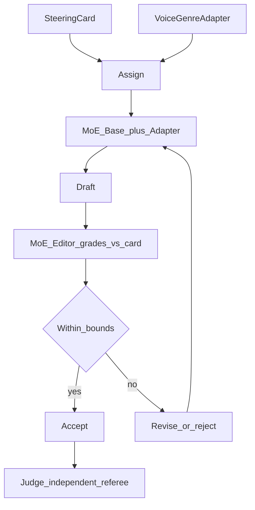
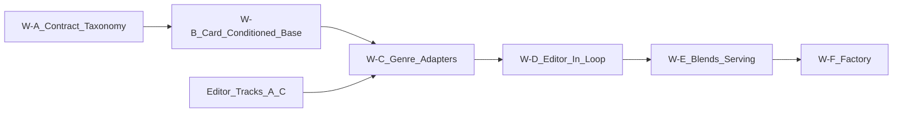

# MoE Style Writer — Training System & Roadmap

**Status:** Architecture + design rules (Jul 2026)
**Audience:** Training / Romance Factory integration
**Related:** [`MOE_STYLE_EDITOR.md`](MOE_STYLE_EDITOR.md), [`PHASE5_STYLE_STEERING.md`](PHASE5_STYLE_STEERING.md), [`LLM-Backends.md`](LLM-Backends.md), [`GPU_RUNBOOK.md`](GPU_RUNBOOK.md)

---

## North-star

Build a **card-conditioned MoE writer** — a generation model that writes **on-card prose in a chosen voice and genre**, coached by the [MoE style editor](MOE_STYLE_EDITOR.md) and refereed independently by the style judge.

This doc exists because "train a writer" was the project's **original** goal and quietly became a footnote to its own support system (judge, editor, teacher councils). The writer is a **co-equal product**, not a downstream consumer.

The writer is **not** a monolith. It is one **MoE base** (chosen for throughput at low active-parameter cost) plus a **small bank of swappable voice/genre LoRA adapters**, driven by a compact **steering card** that carries the fine structural knobs. You *assign* a scene a card + an adapter; the editor tells you whether the result landed.



---

## Where the writer fits: three products, one principle

| Product | Job | Trained on | Rule |
|---------|-----|------------|------|
| **Judge** | Score prose vs rubric + card | classify + judgment pairs | Independent referee — never trained on the writer's reward loop |
| **Editor** | Grade + rewrite at sentence/span/act grain | council labels + rewrite pairs | The writer's **critic** in the training loop |
| **Writer** | *Generate* on-card prose in a voice/genre | card→prose + editor-accepted rewrites | This document |

**Governing principle (extends the editor doc's rule):** judge, editor, and writer are **separate training products**. Never overwrite one with another's data. In particular, the writer must be refereed by a judge that is **held out** from the writer's own reward signal — otherwise the loop closes too tightly and the writer learns to game the metric (see Risks).

All three share the **same MoE base family** (Gemma 4 26B-A4B or successor) so routing capacity and rubric grounding already live in the weights. Training happens on **DGX Spark**; serving is quantized on the **3090 / Mac Mini** (see [`LLM-Backends.md`](LLM-Backends.md)).

---

## Control model: adapters vs card

The single most important design decision. Style splits into **two axes**, and only one of them is an adapter.

| Axis | Examples | Mechanism | Why |
|------|----------|-----------|-----|
| **Genre / voice texture** | fantasy, horror, hardboiled, lyrical-literary | **LoRA adapter** | Lexicon, imagery, tropes, "feel" — hard to specify by prompt alone |
| **Structural rubric knobs** | POV, register, sentence complexity, figurative density, tone | **Steering card** (prompt conditioning) | Continuous, combinatorial, already the card's job (Leech & Short dims) |

**Worked example** — "horror-fantasy, first person, colloquial, terse" decomposes as:

- **Adapter:** `dark-fantasy` (genre texture) — one adapter, or a named blend (below)
- **Card:** `pov: first`, `register: colloquial`, `sentence_complexity: simple_paratactic`, plus the usual tone/figurative knobs

The adapter supplies the genre; the card supplies the structure. **Two mechanisms, never conflated.**

### Design rules (explicit — do not violate)

- **W1 — Rubric knobs live in the card, never in an adapter.** There is no `first_person_LoRA`, no `terse_LoRA`, no `colloquial_LoRA`. POV / register / sentence-length / figurative-density / tone are card fields, conditioned in the prompt on one base. Building adapters for these creates a combinatorial explosion (POV × register × length × tone × …) and they interfere destructively when stacked.
- **W2 — Adapters are coarse genre/voice archetypes only, and the set stays small.** Each adapter must earn its place: only add one when the card alone cannot reach a texture on the base. Prefer 5–15 well-validated archetypes over dozens of thin ones.
- **W3 — Recurring combinations become a named blend, merged offline.** If "dark-fantasy" (horror + fantasy) is a repeat target, **merge the deltas offline** (TIES / DARE-style) or train a dedicated `dark-fantasy` adapter, then **validate the artifact with the editor** and register it. Do **not** rely on live runtime stacking as the primary path.
- **W4 — Live composition is a fallback, capped and validated.** At most **2** adapters active at once, always card-conditioned, always validated through the editor/judge. Independently-trained deltas added together do **not** cleanly equal "A AND B"; quality degrades with each adapter added and is empirical, not guaranteed.
- **W5 — One adapter (or one named blend) per request at serve time.** vLLM / LM Studio multi-LoRA serving is built to route *different requests* to *different adapters*, not to fuse many adapters in one forward pass. Assign exactly one adapter per scene.
- **W6 — The editor is the arbiter of which combinations get minted.** A composition that repeatedly passes the editor against its card is worth promoting to a named blend; one that repeatedly fails becomes a **hard negative** that justifies a dedicated adapter or more card-conditioned SFT.

---

## Target architecture

### Shared substrate

- **Base:** MoE instruct, same family as the judge/editor (Gemma 4 26B-A4B or successor). MoE gives high tok/s at low *active* params — good for local hosting on a 24 GB 3090 or a unified-memory Mac Mini (footprint caveats in [`LLM-Backends.md`](LLM-Backends.md)).
- **Adapters:** LoRA on attention (and optionally expert) projections, one per genre/voice archetype, plus registered named blends.
- **Contract:** the same compact **steering card** (voice / style / tone) the editor grades against (Phase 5B). One card schema across write, grade, and rewrite.

### Assignment interface

```
assign(scene) = { card: <steering_card>, adapter: <archetype | named_blend> }
```

The orchestrator (romance-factory or a harness) picks the card and the single adapter/blend per scene. The card is prompt-level; the adapter is a serve-time selection. Both are logged in the scene metadata alongside the resulting `style_profile`.

### Romance Factory integration (intended use)

```
Plan act/scene → pick card + adapter
  → Writer (base + adapter) drafts under the card
  → MoE editor grades vs card → mismatch list
  → revise (writer or editor rewrite) until within drift bounds
  → merge → manuscript scene with card + adapter + style_profile
```

Plot / character / continuity checks stay outside the writer (existing factory agents).

---

## The writer training loop (actor–critic)

The editor is the **automatic reward signal**; the judge is the **independent check**.

1. **Draft** — writer (base, later base+adapter) generates N words under a target card.
2. **Grade** — editor scores the draft vs the card, emits a mismatch list + a card-hit score.
3. **Select** — keep high-scoring drafts (rejection sampling); discard or bank failures.
4. **Train** — SFT the writer on accepted (card, prose) pairs; later add preference/DPO on editor-scored pairs (better vs worse for the same card).
5. **Referee** — periodically evaluate with the held-out judge + human spot-check; failures feed **hard negatives**.

This is exactly PHASE5 **5C** (closed loop), **5D** (writer LoRA SFT), and **6E** (hard negatives), stated as one cycle. The editor's rewrites double as writer SFT targets; the writer's failures double as editor hard negatives — one compounding data flywheel, not two pipelines.

---

## Adapter lifecycle

```
propose archetype  →  curate card bank + seed data  →  train adapter (Spark)
   →  editor validation gate (card-hit on held-out cards)  →  register
   →  (recurring combo?) merge/train named blend  →  re-gate  →  register
```

An adapter ships only after it clears an **editor validation gate**: given held-out cards in its archetype, does the writer+adapter hit the card knobs materially better than the base+card alone? If not, the card was already enough — do not add the adapter (W2).

---

## Intended purpose of the training data

| Data product | Teaches | Consumes |
|--------------|---------|----------|
| Card→prose pairs | Generate on-card prose | `steering_card` + accepted drafts |
| Rewrite pairs *(shared w/ editor Track C)* | Revise toward a card | before/after prose + cards |
| Preference pairs *(5E)* | Better vs worse for a card | editor-scored draft pairs |
| Voice/genre archetype card bank | Defines the adapter taxonomy | curated cards per archetype |
| Hard negatives *(6E)* | What *not* to do for a card | editor/judge failures |

**Design rule:** the writer's genre adapters are only as distinct as the **card bank / archetype taxonomy** behind them. Voice diversity is a data-curation problem first, a model problem second.

---

## Where we are now

| Capability | State | Notes |
|------------|-------|-------|
| Steering card schema (5B) | **Not started** | Shared contract for write/grade/rewrite |
| Voice/genre archetype taxonomy + card bank | **Not started** | Prereq for any adapter |
| Card-conditioned base SFT (no adapters) | **Not started** | Prove the card controls the base first |
| Editor available as critic | **Blocked on editor** | See `MOE_STYLE_EDITOR.md` Tracks A–C |
| Genre/voice adapters | **Not started** | After base follows the card |
| Editor-in-the-loop (5C/5D) | **Not started** | Latent in PHASE5 |
| Named blends + multi-LoRA serving | **Not started** | Track W-E |
| Factory assignment (card + adapter per scene) | **Not started** | Track W-F |

**Honest summary:** the writer is currently a **plan**, not weights. Its critical dependency is a trustworthy editor; do not train genre adapters or an editor-in-the-loop before the editor's span teacher (editor Track A) and rewrite data (editor Track C) exist.

---

## Gaps

- **GW1 — No card contract yet.** Write, grade, and rewrite must share one `steering_card` schema (PHASE5 5B). Without it the writer and editor grade different things.
- **GW2 — No archetype taxonomy.** "Different voices" needs an explicit bank of genre/voice cards; otherwise adapters are indistinct.
- **GW3 — No card-conditioned generation data.** Need (card, prose) pairs, initially from a frontier/factory writer, kept only if the editor says the card was hit.
- **GW4 — Editor dependency.** The reward signal is the editor; it is not trained yet (editor Tracks A–D).
- **GW5 — Composition unproven.** Named-blend merge quality (TIES/DARE) and 2-adapter live stacking need empirical validation gates.
- **GW6 — Reward-hacking guardrails.** No held-out judge protocol or human spot-check cadence defined for the writer loop.

---

## Systems to be completed (ordered)

Writer tracks **gate on the editor** — do not start W-C until the editor can grade spans reliably.

### Track W-A — Contract & taxonomy (foundation)

1. Finalize the shared `steering_card` schema (with PHASE5 5B).
2. Build a **voice/genre archetype card bank** (fantasy, horror, hardboiled, lyrical-literary, …) — this defines the adapter set.

### Track W-B — Card-conditioned base (no adapters yet)

3. Generate (card, prose) pairs; keep only editor-validated hits.
4. SFT the base to **follow the card** on the shared MoE base — prove the *card* controls POV/register/length/tone before adding any adapter (W1).

### Track W-C — Genre/voice adapters

5. Per archetype: curate data, train a LoRA on Spark, pass the **editor validation gate** (W2).
6. Register adapters with their archetype card ranges.

### Track W-D — Editor-in-the-loop (actor–critic)

7. Stand up the draft → grade → select → SFT loop (5C/5D).
8. Add preference/DPO on editor-scored pairs (5E); feed hard negatives (6E).
9. Referee with the **held-out judge** + human spot-check (reward-hacking guard, GW6).

### Track W-E — Named blends & serving

10. Merge recurring combos offline (TIES/DARE) or train dedicated blends; re-gate (W3).
11. Serve quantized base + adapters via vLLM/LM Studio, **one adapter per request** (W5).

### Track W-F — Factory integration

12. Wire `assign(scene) = {card, adapter}` into the factory draft→grade→revise→merge loop.



---

## Risks

- **Reward hacking** — the writer satisfies the editor's metrics with hollow prose. *Mitigate:* keep the judge held out from the writer's reward (W4/GW6), diversify cards, gate on human spot-checks.
- **Voice collapse** — adapters converge to a bland average. *Mitigate:* a real archetype taxonomy (GW2), per-adapter validation gates.
- **Adapter interference** — stacking degrades output. *Mitigate:* W3–W5 (prefer named blends, cap live stacking at 2, one-per-request serving).
- **Card overfit** — writer games enum labels rather than producing readable prose. *Mitigate:* human readability spot-check as a gate the editor cannot replace.

---

## Recommended near-term focus

1. **Do not start the writer before the editor can grade.** Its reward signal does not exist yet.
2. Land the **shared card schema** (5B) — the one artifact write / grade / rewrite all need.
3. Start the **archetype card bank** now; it is data curation and unblocks W-B/W-C regardless of model progress.
4. First model milestone is **card-conditioned base SFT** (W-B), *not* adapters — prove the card controls the base before minting any `dark-fantasy` LoRA.

---

## File map

| Path | Role |
|------|------|
| `docs/MOE_WRITER.md` | This document |
| `docs/MOE_STYLE_EDITOR.md` | The writer's critic (grade + rewrite) |
| `docs/PHASE5_STYLE_STEERING.md` | Judge → steer → novel roadmap (5B card, 5C/5D writer loop) |
| `docs/LLM-Backends.md` | Base/adapter hosting, candidate models, per-task selection |
| `train/train_config.gemma4_spark.toml` | Spark LoRA config (shared base family) |

---

## How to update this doc

When a Track item lands: bump **Where we are now**, mark the Track step, and link any new adapter registry / card bank / loop scripts. Keep the **adapter-vs-card design rules (W1–W6) stable** — they are the contract that stops the taxonomy from exploding. If a rubric knob ever genuinely needs an adapter, change W1 deliberately and document why.
